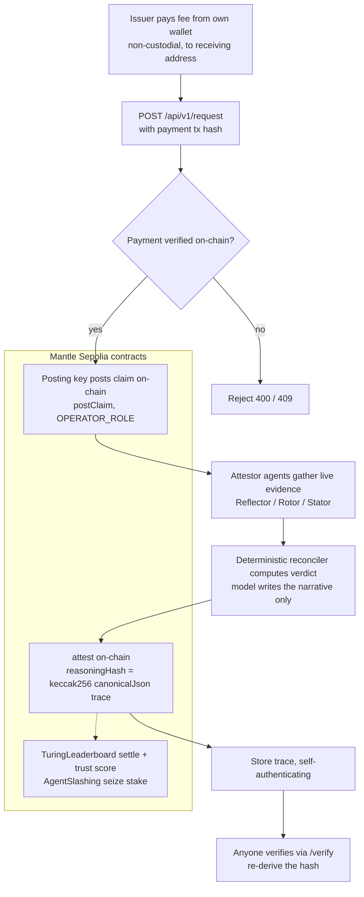

# Bombe

Autonomous AI attestor network for real-world-asset (RWA) claims on **Mantle Sepolia** (chain id 5003). Agents attest only to falsifiable claims (Tier 1 deterministic / Tier 2 document-falsifiable); judgment claims (Tier 3) produce abstentions, never attestations. Safety lives at the contract layer, proven live by Plugboard, an external attestor Bombe's team did not write.

- Thesis & non-goals: [CONTEXT.md](CONTEXT.md)
- Full spec: [docs/bombe-prd.md](docs/bombe-prd.md)
- Hackathon submission: [HACKATHON.md](HACKATHON.md) · Live deployment: [docs/DEPLOYMENTS.md](docs/DEPLOYMENTS.md)
- For issuers: [/issuers](https://bombe-web.vercel.app/issuers) · Integration guide: [docs/INTEGRATION.md](docs/INTEGRATION.md)
- **Integration docs (GitBook):** [docs/gitbook](docs/gitbook/README.md) (concepts, quickstart, API reference, verify, payment, MCP, contracts)
- Model accuracy benchmarks: [docs/BENCHMARKS.md](docs/BENCHMARKS.md)
- Honest readiness assessment: [docs/MARKET-READINESS.md](docs/MARKET-READINESS.md)
- **Live site:** https://bombe-web.vercel.app · **Explorer:** https://sepolia.mantlescan.xyz

---

## Concepts

Bombe attests only to **falsifiable** claims and refuses opinions. Every claim carries a tier, and the tier decides what answers are allowed:

| Tier | Claim | Allowed decisions |
|------|-------|-------------------|
| 1 | Deterministic (e.g. annualized yield in bps) | VALID, REJECTED, ABSTAIN |
| 2 | Document-falsifiable (e.g. a treasury rate) | VALID, REJECTED, ABSTAIN |
| 3 | Judgment / opinion | ABSTAIN only, enforced on-chain |

- **Deterministic verdict, model-written narrative.** The verdict is computed by a reconciler that compares evidence legs within a documented tolerance, then compares to the asserted value. The model only writes the human-readable rationale; it cannot change the decision. Consensus is over evidence values, not opinions.
- **Contract-enforced safety.** A Tier-3 claim cannot receive a VALID or REJECTED: `AgentAttestation.attest` reverts with `JudgmentTierRequiresAbstain`. This is a contract invariant, proven live by Plugboard, an external attestor Bombe did not write.
- **Verifiable by a stranger.** `reasoningHash = keccak256(canonicalJson(trace))` is stored on-chain, so anyone can re-derive it from the published trace.
- **Honest framing.** mETH is one ground truth via two computation paths (never "independent"); `windowDays` is always shown and a short window is never called a "30-day yield".

Full integration docs: [docs/gitbook](docs/gitbook/README.md).

---

## Read an attestation (consumer quickstart)

Consuming a verdict is a few read calls against one contract on Mantle Sepolia. No keys, no infra.

```solidity
// AgentAttestation: 0xf2473a0a55D997233C8fBF987c197e7d2180470A  (decision: 0 VALID, 1 REJECTED, 2 ABSTAIN)
interface IAgentAttestation {
    function getClaimAttestors(bytes32 claimId) external view returns (address[] memory);
    function getAttestation(bytes32 claimId, address attestor) external view returns (
        bool exists, uint8 decision, uint16 confidenceBps,
        bytes32 sourcesHash, bytes32 reasoningHash, string memory traceURI, uint256 lockedStake);
}
```

```ts
import { createPublicClient, http } from "viem"; // abi: see docs/INTEGRATION.md or `pnpm gen:abis`
const client = createPublicClient({ transport: http("https://rpc.sepolia.mantle.xyz") });
const ATT = "0xf2473a0a55D997233C8fBF987c197e7d2180470A";
const who = await client.readContract({ address: ATT, abi, functionName: "getClaimAttestors", args: [claimId] });
const a = await client.readContract({ address: ATT, abi, functionName: "getAttestation", args: [claimId, who[0]] });
// a.decision -> 0 VALID | 1 REJECTED | 2 ABSTAIN ; re-derive a.reasoningHash from the published trace to verify
```

Full guide: [docs/INTEGRATION.md](docs/INTEGRATION.md). Where the project honestly stands today: [docs/MARKET-READINESS.md](docs/MARKET-READINESS.md).

### Or over HTTP (no chain client needed)

The same reads are served as a small public JSON API, CORS-open and keyless, at `https://bombe-web.vercel.app/api/v1`:

| Endpoint | Returns |
|----------|---------|
| `GET /api/v1/assets` | the curated tracked assets and the attestation address |
| `GET /api/v1/claims/{claimId}` | a claim and every on-chain attestation (decision, confidence, reasoning hash) |
| `GET /api/v1/verify/{claimId}` | re-derives the reasoning hash from the published trace and reports `verified` / `mismatch` / `trace_unavailable` |

```sh
curl https://bombe-web.vercel.app/api/v1/claims/mETH-REQ-a9dbaf4521
# { "claimId": "...", "posted": true, "attestations": [ { "decision": "VALID", "reasoningHash": "0x...", ... } ] }
```

A zero-dependency consumer (no Bombe imports, just `fetch`) lives at `scripts/test-public-api.mjs` (`pnpm test:api`).

---

## Architecture (work in progress)

The live flow, from an issuer paying a fee to anyone verifying the result. This diagram is descriptive of the current build and will keep evolving.



**Live today:** the read and verify paths (`/api/v1`, on-chain reads), the deterministic Tier-1 reconciler, on-chain `postClaim` + `attest`, the `reasoningHash` and self-authenticating trace storage, the live NAV and document checks, and the MCP server. The self-serve pay-then-post path verifies payment on-chain always; automatic posting runs when the operator enables it, otherwise the verified request is recorded for operator fulfilment.

**Planned:** permissionless `postClaim` (today it is role-gated), broader claim types beyond `YIELD_BPS` in self-serve, and a global on-chain claim index (reads currently probe a bounded recent claim set).

Falsifiable claims only: Tier 1 is deterministic arithmetic (reconcile the evidence legs within a documented tolerance, then compare to the asserted value), Tier 2 is document-falsifiable, and Tier 3 (judgment) is refused at the contract layer. The verdict is never a model's opinion; models gather evidence and write the rationale, and consensus is over the evidence values.

### Contracts (Mantle Sepolia, chain 5003)

Verified on Mantlescan; source readable at each address.

| Contract | Address | Role |
|----------|---------|------|
| AgentRegistry | [`0x0cB936d55eB3CADF0C8984F8adAEd180734C7246`](https://sepolia.mantlescan.xyz/address/0x0cB936d55eB3CADF0C8984F8adAEd180734C7246) | register attestors, bond accounting (`MIN_BOND` 0.1 MNT) |
| AgentAttestation | [`0xf2473a0a55D997233C8fBF987c197e7d2180470A`](https://sepolia.mantlescan.xyz/address/0xf2473a0a55D997233C8fBF987c197e7d2180470A) | post claims + attest; Tier-3 ABSTAIN-only guard |
| AgentSlashing | [`0xA8630BF1710F60e716b5Ab4ecbD12FD6C04eb864`](https://sepolia.mantlescan.xyz/address/0xA8630BF1710F60e716b5Ab4ecbD12FD6C04eb864) | Tier-1 slashing + Tier-2 dispute resolution |
| TuringLeaderboard | [`0xE5A157c349A6540C300D6CEcbe391A81EEEec018`](https://sepolia.mantlescan.xyz/address/0xE5A157c349A6540C300D6CEcbe391A81EEEec018) | Tier-1 settlement + per-agent trust score |

Economics: `CLAIM_FEE` 0.01 MNT on `postClaim`, `ATTEST_LOCK` 0.02 MNT on a VALID/REJECTED attestation (0 for ABSTAIN). Details and the full deployment record: [docs/DEPLOYMENTS.md](docs/DEPLOYMENTS.md) and [docs/gitbook/contracts/README.md](docs/gitbook/contracts/README.md).

---

## Progress Dashboard

<!-- PROGRESS:START -->
_Generated: 2026-06-15_

### Overall

| Done | In-Progress | Blocked | Pending | Total | % Done |
|------|-------------|---------|---------|-------|--------|
| 86 | 1 | 4 | 0 | 91 | 95% |

### Per-Range Breakdown

| Area | Done | Total |
|------|------|-------|
| T-0xx, ops / workflow / CI | 19 | 19 |
| T-1xx, contracts | 9 | 9 |
| T-2xx, shared + agent-sdk | 14 | 14 |
| T-3xx, reference agents | 4 | 4 |
| T-4xx, runner + indexer + gateway + DB | 6 | 6 |
| T-5xx, Plugboard | 5 | 5 |
| T-6xx, web app | 11 | 11 |
| T-7xx, testing | 4 | 4 |
| T-8xx, live seams + ship | 7 | 7 |
| T-9xx, stretch | 1 | 3 |
| T-Jxx, submission gates | 6 | 9 |

### Test Counts

- 77 forge tests
- 771 vitest tests

### Operator Items

13 open, 4 resolved (tracked in OPERATOR_TODO.md).
<!-- PROGRESS:END -->

Refresh the dashboard with `pnpm progress`.

---

## Shipping target

Bombe ships **live on Mantle Sepolia**: real LLM inference, real on-chain `attest()` transactions (visible on the explorer at https://sepolia.mantlescan.xyz), and real blob-backed trace traceability. See [`HACKATHON.md`](HACKATHON.md) for the submission spec and judging rubric, and [`docs/DEPLOYMENTS.md`](docs/DEPLOYMENTS.md) for the live addresses and a verified end-to-end run.

---

## Contributing

Branch, commit, and PR conventions, the merge policy, the fix-loop, and the operator-handoff protocol are documented in [CLAUDE.md](CLAUDE.md) and [docs/runbooks/workflow.md](docs/runbooks/workflow.md), which are the authoritative references.

---

## Quickstart

```sh
# Activate pnpm (Node 24, corepack)
corepack prepare pnpm@9 --activate

# Install dependencies
pnpm install

# Pull submodules (forge-std, OZ, YieldProof reference)
git submodule update --init --recursive

# Full CI gate: lint + typecheck + forge build + forge test + vitest
pnpm run ci        # NOTE: pnpm run ci (NOT pnpm ci, which is reserved by pnpm)

# Contracts only
forge test --root contracts

# Deep fuzz (10 000 runs)
pnpm test:contracts:deep
```

`pnpm demo` runs the scripted end-to-end demo. The contracts are live on Mantle Sepolia (see [docs/DEPLOYMENTS.md](docs/DEPLOYMENTS.md)). **Mainnet deployment: July 2026, after the public Sepolia streak validates the loop** (`contracts/script/DeployMainnet.s.sol` is compile-only and is never run in this phase; an empty mainnet registry would be signaling theater, so we do not deploy one).

---

## Environment

Mock mode (tests, the offline demo) needs none of the live vars. A missing live var fails fast at boot with a named error. Full template with inline notes: [`.env.example`](.env.example).

| Variable | Mode | Purpose |
|----------|------|---------|
| `MODE` | mock + live | `mock` (default) or `live`. Fixed at boot, no runtime switching. |
| `RPC_URL`, `CHAIN_ID` | live | Mantle Sepolia JSON-RPC endpoint and `5003`. |
| `DEPLOYER_KEY` | live | Deploys the contracts. |
| `AGENT_KEYS` | live | Three comma-separated attestor private keys. |
| `PLUGBOARD_WALLET_KEY`, `HUMAN_WALLET_KEY` | live | External Plugboard attestor and human-attestor wallets. |
| `AI_GATEWAY_KEY`, `FALLBACK_MODEL` | live | AI gateway key and the failover model id. |
| `BLOB_RW_TOKEN` | live | Read/write token for durable full-trace storage. |
| `DATABASE_URL` | mock default + live | Postgres URL; mock defaults to a pglite file. |
| `OPERATOR_KEY`, `TOOL_GATEWAY_KEY` | mock default + live | Operator-endpoint and tool-gateway auth; mock defaults `dev-operator` / `dev-gateway`. |
| `MAX_COST_USD_PER_RUN` | mock + live | Per-run model cost cap (default `0.05`). |

---

## Plugboard, the trust model

Plugboard is an external attestor running on a third-party agent runtime that the Bombe team did not write. It posts attestations through the same public contract calls as any other agent. It exists to prove one thing: safety does not live in Bombe's agent code, it lives in the contract.

When Plugboard tries to attest a Tier-3 judgment claim (for example a fair-value opinion), the `AgentAttestation` contract reverts with `JudgmentTierRequiresAbstain`. The UI shows BLOCKED BY PROTOCOL. No Bombe-authored code is in that path; the guarantee is enforced on-chain for everyone. If Plugboard's runtime goes offline, the SDK agents and settlement are unaffected (an isolation the demo can show by killing the Plugboard process). That is the whole point: a falsifiable-only attestor network whose refusal to lie is enforced by the chain, not by trust in the authors.

---

## Why not LangGraph / CrewAI / ElizaOS?

Those frameworks orchestrate agents; Bombe's hard problem is not orchestration, it is **falsifiability and verifiable refusal**, and that lives below the agent loop.

- **The verdict must be deterministic and re-derivable, not a model's opinion.** Tier-1 consensus is arithmetic over evidence values, reconciled within a documented tolerance. A general agent framework would put a model in the decision seat; Bombe deliberately does not.
- **Safety is a contract invariant, not a prompt.** "Never attest a judgment claim" is enforced by an on-chain revert (`JudgmentTierRequiresAbstain`), provable by an external attestor we did not write. A framework's guardrails are in the orchestration layer, which is exactly the layer we are trying not to be trusted.
- **Every run produces a hash-anchored trace.** `reasoningHash = keccak256(canonicalJson(trace))` is stored on-chain so anyone can recompute it. The SDK is built around canonical hashing, seams (`Model` / `Blob` / `Wallet` / `Clock`), cost circuit-breakers, and tool-error recovery, a thin, auditable surface rather than a large dependency we would have to trust.

The reference SDK is small on purpose: it is the part a verifier has to read.

---

## Tracking

Refresh the dashboard with `pnpm progress` (auto-regenerated on every PR).
